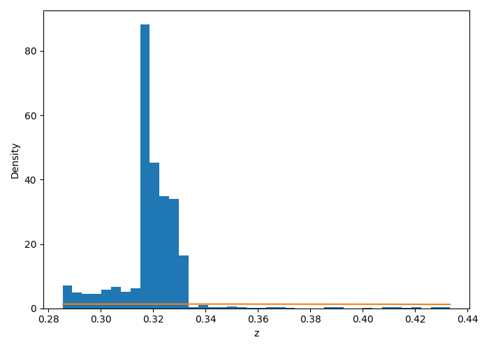

# Assignment–2: Learning Probability Density Functions Using Data Only

##  Dataset
The dataset used for this assignment is the India Air Quality Dataset obtained from Kaggle.
The feature considered for this task is NO₂ concentration (x).
**Dataset Link:** https://www.kaggle.com/datasets/shrutibhargava94/india-air-quality-data  

##  Objective
The objective of this assignment is to learn the probability density function (PDF) of a transformed random variable using only data samples.

## Transformation Parameters
The input feature x (NO2 concentration) is transformed as:
z = x + a_r * sin(b_r * x)

Where, for a university roll number r: 102303951

- a_r = 0.5 * (r mod 7) 
- b_r = 0.3 * ((r mod 5) + 1)

These parameters personalize the transformation while keeping the dataset unchanged.

---

## GAN Architecture

The GAN consists of **Generator** and **Discriminator** networks.

### Generator
- **Input:** Random noise from standard normal distribution N(0,1)  
- **Architecture:**
  - Fully connected layer: 1 → 32, ReLU
  - Fully connected layer: 32 → 32, ReLU
  - Fully connected layer: 32 → 1
- **Output:** Synthetic samples z_f

### Discriminator
- **Input:** Real samples z and generated samples z_f  
- **Architecture:**
  - Fully connected layer: 1 → 32, ReLU
  - Fully connected layer: 32 → 1, Sigmoid
- **Output:** Probability of the sample being real

**Training:** Both networks are trained adversarially using binary cross-entropy loss.

---

## PDF Plot from GAN Samples
- After training, a large number of samples are generated from the generator.  
- Probability Density Function (PDF) of the transformed variable z is estimated using Kernel Density Estimation (KDE).  
- Histogram of generated samples is plotted along with the estimated PDF.

---

## Observations
- **Mode Coverage:** Generator captures the main modes of the transformed distribution.  
- **Training Stability:** Generator and discriminator losses converge gradually without oscillations.  
- **Quality of Generated Distribution:** Estimated PDF closely follows the empirical distribution of the transformed data.

---

## Conclusion
This assignment demonstrates that **Generative Adversarial Networks (GANs)** can effectively learn unknown probability density functions using only data samples, without requiring any prior assumptions about the analytical form of the distribution.
